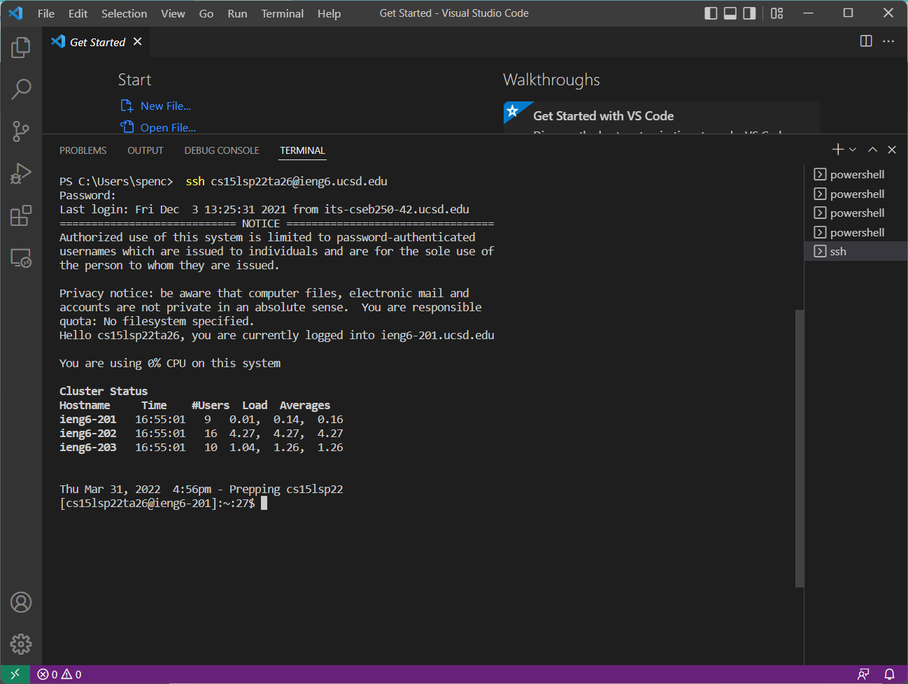
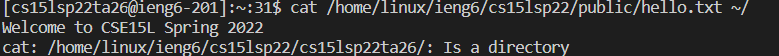
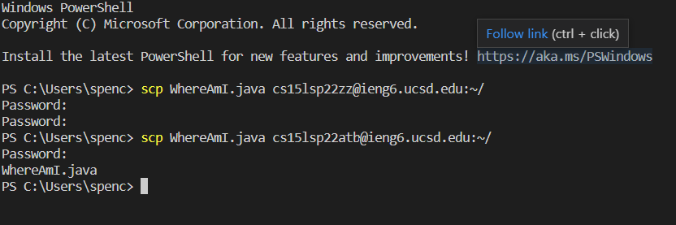
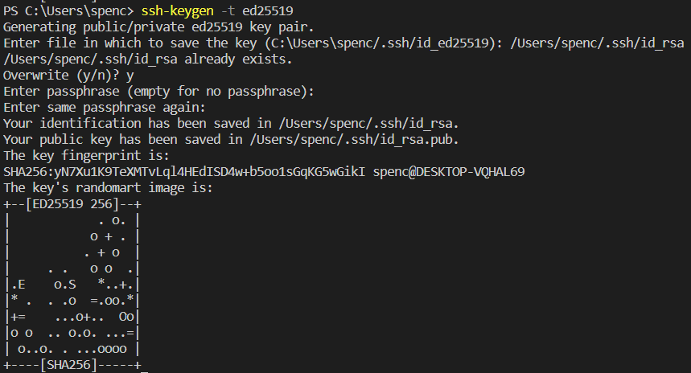
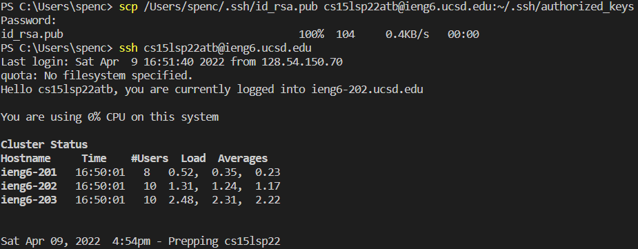
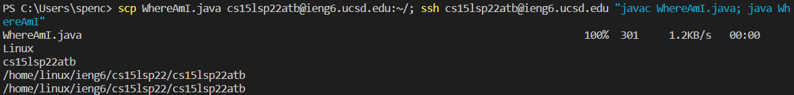

# Lab Report 1

## Spencer Kauffman

---

### Installing VSCode

* Install VSCode [here](https://code.visualstudio.com/)
* Open VSCode (should look like image below)


---

### Remotely Connecting

* If on Windows, install [OpenSSH](https://docs.microsoft.com/en-us/windows-server/administration/openssh/openssh_install_firstuse)
* Look up course-specific account by logging in [here](https://sdacs.ucsd.edu/~icc/index.php)
* Enter
`$ ssh cs15lsp22zz@ieng6.ucsd.edu` into the terminal, replacing zz with the letters in your account, then enter your password
* The terminal will look like this if you have successfully connected:



---

### Trying Some Commands

* Once you are in the terminal and connected, try running some commands
* Here's an example of running the cat command:



---

### Moving Files with `scp`

* Copy a file from the client to the remote computer by running the  command: `$ scp <file> cs15lsp22zz@ieng6.ucsd.edu:~/`
* Here is an example of using `scp` on a file called `WhereAmI.java`:



* Enter password, then log back into the remote computer and use `ls` to view the file. You can now run the file with `javac` and `java`.

---

### Setting an SSH Key

*If on Windows, be sure to complete the `ssh-add` steps [here](https://docs.microsoft.com/en-us/windows-server/administration/openssh/openssh_keymanagement#user-key-generation)

* Enter `$ ssh-keygen` into the terminal, and do not add a passphrase (hit enter twice). The following should appear in the terminal:



* Copy the public key to the `.ssh` directory on the remote computer:

```
$ ssh cs15lsp22zz@ieng6.ucsd.edu
<Enter Password>
# now on server
$ mkdir .ssh
$ <logout>
$ scp /Users/<user-name>/.ssh/id_rsa.pub
cs15lsp22zz@ieng6.ucsd.edu:~/.ssh/authorized_keys
```

* `ssh` and `scp` should now work without needing a password:



--- 

### Optimizing Remote Running

* To optimize remote running, use semicolons to rin multiple commands at once and quotes to directly run commands on the remote server before exiting.
* Here is an example of using these techniques to make a local edit to a file `WhereAmI.java`, then copying and running the file on the remote server:



---