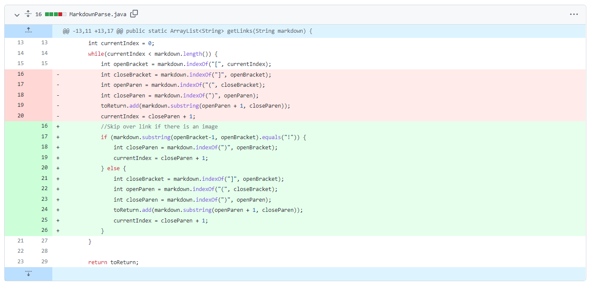
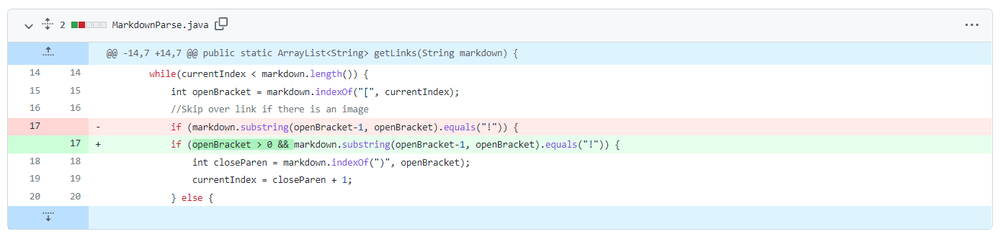
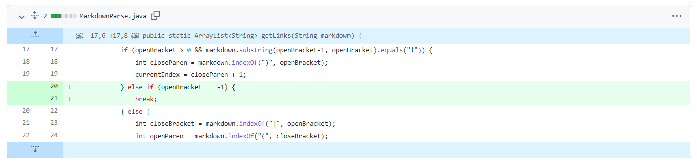

# Lab Report 2

## Spencer Kauffman

---

### Code Change #1

Failure-inducing input: [new-test-file](new-test-file.md)

Symptom of bug:
```
[https://g.com, image.png]
```

Change:


> This bug was an issue where images were parsed as if they were photos, which returned image files in the output. The failure-inducing input included an image, which then appeared as a symptom in the output, including image.png in the returned list.

---

### Code Change #2

Failure-inducing input: [new-test-file1](new_test-file1.md)

Symptom of bug:
```
Exception in thread "main" java.lang.StringIndexOutOfBoundsException: begin -1, end 0, length 21
        at java.base/java.lang.String.checkBoundsBeginEnd(String.java:4601)
        at java.base/java.lang.String.substring(String.java:2704)
        at MarkdownParse.getLinks(MarkdownParse.java:17)
        at MarkdownParse.main(MarkdownParse.java:36)
```

Change:


> This bug was an issue in the code where the character before the open bracket of a link was searched, which would throw an IndexOutOfBoundsException if the file began with a link. Thus, the failure-inducing input caused a symptom in the output where an exception was thrown.

---

### Code Change #3

Failure-inducing input: [new-test-file2](new-test-file2.md)

Symptom of bug:
```
Exception in thread "main" java.lang.StringIndexOutOfBoundsException: begin 0, end -1, length 38
        at java.base/java.lang.String.checkBoundsBeginEnd(String.java:4601)
        at java.base/java.lang.String.substring(String.java:2704)
        at MarkdownParse.getLinks(MarkdownParse.java:25)
        at MarkdownParse.main(MarkdownParse.java:37)
```

Change:


> This bug was an issue in the code that, when no links were present in the markdown file, the parser would attempt to add a substring to the list whose starting index is -1 (value of openParen by indexOf when there is no open parenthesis). The failure-inducing output was a markdown file with no links, which resulted in an IndexOutOfBoundsException as a symptom due to the negative value of openParen.