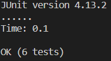

# Lab Report 3

## Spencer Kauffman

---

### Streamlining SSH Configuration

SSH Config File:

SSH Alias Login:

SCP with Alias:

---

### Setup Github Access From `ieng6`

Public Key on GitHub:

Private Key on `ieng6`:

Commit & Push on `ieng6`:

Link to Commit [here](https://github.com/spencerkauffman/markdown-parser/commit/2af5c8b80facc2c4be3a0cd0b47a48b50cfdd439)

---

### Copy Whole Directories with `scp -r`

Copy whole `markdown-parser` directory:

SSH Login & Run:

Combining `scp` and Run Remotely:

