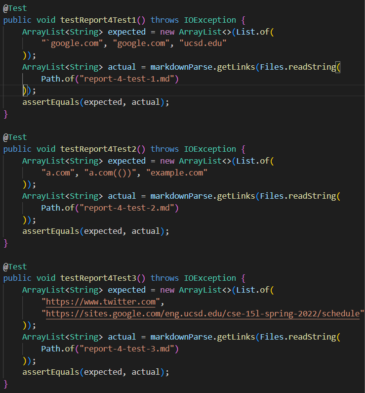
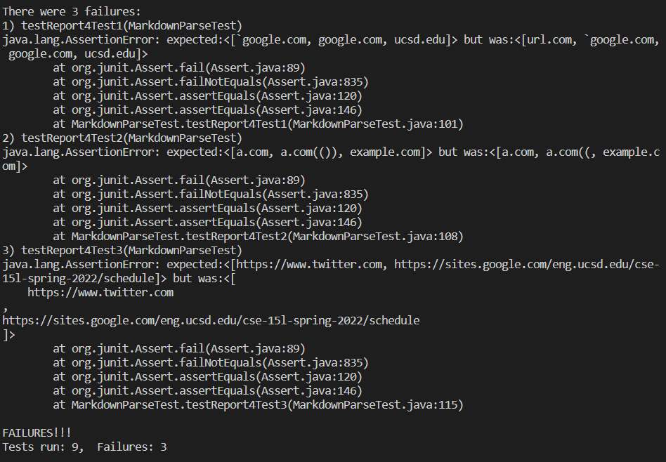
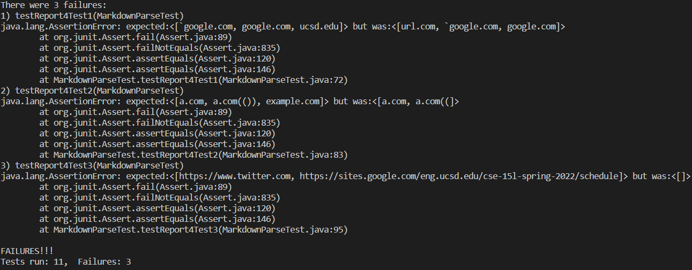

# Lab Report 4

## Spencer Kauffman

---

### Repository Links

[My Repository](https://github.com/spencerkauffman/markdown-parser)

[Reviewed Repository](https://github.com/rmccrystal/markdown-parser)

---

### Tests

Snippet 1 Expected Output:

```
[`google.com, google.com, ucsd.edu]
```

Snippet 2 Expected Output:

```
[a.com, a.com(()), example.com]
```

Snippet 3 Expected Output:

```
[https://www.twitter.com, https://sites.google.com/eng.ucsd.edu/cse-15l-spring-2022/schedule]
```

Tests in `MarkdownParseTest`:



My Repository Test Results:



Reviewed Repository Test Results:



Code Changes for My Repository:

1. A small code change could be implemented for this example, such as a statement which checks if any part of the link structure is inside backticks and discounts the link from the final list.

2. I dont know if a small code change could be implemented for this case. A fix would have to keep track of how many parenthesis are open and mark closeParen at the closure of the last parenthesis, which may take a more involved approach.

3. A small code change could likely be implemented for this snippet. The elements in the list just need to all be on the same line, as opposed to showing up with line breaks, which would require some formatting.