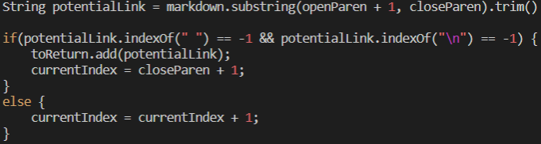

# Lab Report 5

## Spencer Kauffman

---

> To find the tests with different results, I used vimdiff on two results files and observed which parts were highlighted.

### Tests with Different Results

Output from `vimdiff` (left is mine, right is other)

---

`test-file` [194](https://github.com/nidhidhamnani/markdown-parser/blob/main/test-files/194.md)

For this test file, neither implementation has the correct output.

Proper output: [my_(url)]

To fix the test in the other repository, one would have to modify the code which copies the text in between the parenthesis, since only the part in the parenthesis is counted, while VSCode states all the output after the colon should be included in the link.

---

`test-file` [201](https://github.com/nidhidhamnani/markdown-parser/blob/main/test-files/201.md)

For this test file, my implementation produces the proper output `[]`, but the other implementation's contains a link.

Proper output: []

To fix this test in the other repository, one might add some code to the below section of code to see if there is any text in between the close bracket and open parenthesis and discount the link in this case.

